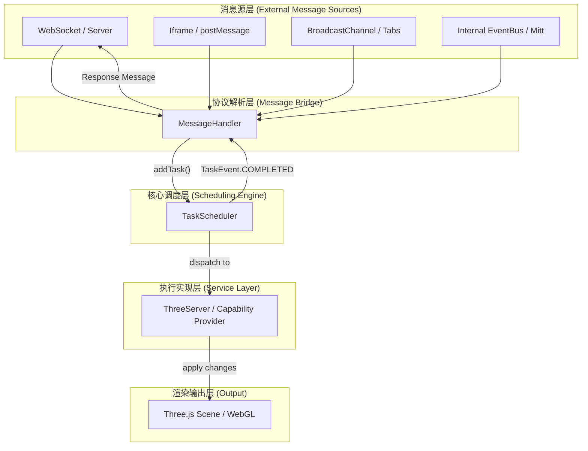

# Three.js 任务调度器 (Task Scheduler)

一个高性能、工业级的 TypeScript 任务调度器，专为 Three.js 3D 场景及复杂异步工作流设计。它通过智能调度算法，在保证 UI 60FPS 流畅度的前提下，实现了复杂任务依赖的高效管理。

## 1. 系统架构图

本项目支持通过多种通信渠道（WebSocket、Iframe postMessage、BroadcastChannel 等）驱动 3D 场景更新。架构如下：



## 2. 核心特性 (v2.0 优化版)

✅ **智能调度算法**
- **DAG 依赖管理**：基于有向无环图的事件驱动触发，彻底告别忙轮询。
- **优先级继承**：自动提升依赖链优先级，解决“优先级反转”死锁。
- **环境感知调度**：自适应浏览器 `RAF` 与后台/Node.js `setTimeout`。

✅ **任务控制与容错**
- **指数退避重试**：重试延迟随次数呈指数增长，保护系统负载。
- **协作式调度支持**：提供 `context.shouldYield()`，长任务可平滑分片。
- **资源自动清理**：内置垃圾回收机制，根据 `retentionPeriod` 自动清理历史任务状态，防止内存泄漏。

## 3. 高效集成指南：ThreeServer + TaskScheduler

如果你有一个包含大量绘图和模型处理方法的 `ThreeServer` 类，建议采用 **“命令分发模式”** 进行集成。

### 3.1 改造服务类方法
使 `ThreeServer` 的方法感知调度上下文，以实现真正的异步分片执行。

```typescript
class ThreeServer {
  // 示例：批量绘制复杂点位
  async drawComplexPoints(data: any, context: TaskContext) {
    const { points } = data;
    for (let i = 0; i < points.length; i++) {
      // 1. 响应中止信号
      if (context.signal.aborted) return;

      // 2. 执行图形操作
      this.addPointToScene(points[i]);

      // 3. 高效结合点：每处理 100 个元素检查是否需要让出主线程
      if (i % 100 === 0 && context.shouldYield()) {
        await new Promise(resolve => setTimeout(resolve, 0));
      }
      
      context.reportProgress((i / points.length) * 100);
    }
  }
}
```

### 3.2 注入调度器能力
在应用初始化时，将 `ThreeServer` 实例的方法注册为调度器的执行器。

```typescript
const threeServer = new ThreeServer(scene);
const scheduler = new TaskScheduler();

// 建立映射关系
scheduler.registerExecutor(TaskType.DRAW_POINTS, (data, context) => 
  threeServer.drawComplexPoints(data, context)
);

scheduler.registerExecutor(TaskType.LOAD_MODEL, (data, context) => 
  threeServer.loadModel(data, context)
);

scheduler.start();
```

### 3.3 结合多渠道通信
利用协议解析层将外部消息转化为调度任务。

```typescript
// 以 WebSocket 为例
socket.onmessage = (event) => {
  const msg = JSON.parse(event.data);
  
  // 转化为调度器任务
  scheduler.addTask({
    id: msg.id,
    type: msg.commandType, // 如 TaskType.DRAW_POINTS
    data: msg.payload,
    priority: msg.priority || TaskPriority.NORMAL
  });
};
```

## 4. 快速开始

### 4.1 基础配置

```typescript
import { TaskScheduler } from './TaskScheduler';
import { TaskType, TaskPriority, TaskRetryStrategy } from './types';

const scheduler = new TaskScheduler({
  maxTasksPerFrame: 5,      // 每帧最多启动 5 个新任务
  frameTimeBudget: 6,       // 每帧分配给 JS 执行的预算为 6ms (预留空间给渲染)
  maxConcurrentTasks: 3,    // 最大并发异步任务数
  retentionPeriod: 60000,   // 完成的任务状态保留 60 秒后自动清理
});

scheduler.start();
```

### 2. 定义具有协作能力的任务

```typescript
scheduler.registerExecutor(TaskType.COMPUTE, async (data, context) => {
  for (let i = 0; i < data.items.length; i++) {
    // 1. 检查中止信号
    if (context.signal.aborted) throw new Error('Cancelled');
    
    // 2. 协作式调度：如果当前帧时间已用完，建议主动让出
    if (context.shouldYield()) {
      await new Promise(resolve => setTimeout(resolve, 0));
    }

    processItem(data.items[i]);
    context.reportProgress((i / data.items.length) * 100);
  }
});
```

### 3. 使用高级重试与依赖

```typescript
const taskId = scheduler.addTask({
  type: TaskType.LOAD_MODEL,
  priority: TaskPriority.NORMAL,
  retryCount: 3,
  retryStrategy: TaskRetryStrategy.EXPONENTIAL, // 指数退避重试
  dependencies: ['pre-config-task'],           // 只有等 pre-config-task 完成后才触发
  data: { url: '/models/scene.glb' }
});
```

## API 参考

### SchedulerConfig (配置项)

| 参数 | 类型 | 默认值 | 说明 |
| :--- | :--- | :--- | :--- |
| `maxTasksPerFrame` | `number` | `5` | 每帧允许从队列启动的最大任务数 |
| `frameTimeBudget` | `number` | `6` | 每帧分配的执行时间预算 (ms) |
| `maxConcurrentTasks` | `number` | `3` | 允许同时处于 RUNNING 状态的任务上限 |
| `retentionPeriod` | `number` | `60000` | 任务完成后状态保留时长 (ms) |
| `queueSizeLimit` | `number` | `1000` | 任务池最大容量 |

### TaskContext (执行上下文)

| 属性/方法 | 说明 |
| :--- | :--- |
| `taskId` | 当前任务的唯一 ID |
| `signal` | `AbortSignal` 对象，用于响应取消操作 |
| `reportProgress(n)` | 报告进度 (0-100) |
| `shouldYield()` | **核心方法**：返回 true 表示当前帧预算已耗尽，建议任务 `await` 挂起 |

## 进阶机制说明

### 优先级继承原理
当一个 `HIGH` 优先级的任务被添加到调度器，且它依赖于一个已经在队列中的 `LOW` 优先级任务时：
1. 调度器会递归遍历依赖链。
2. 将该 `LOW` 任务临时提升为 `HIGH` 优先级。
3. 确保依赖项能够尽早执行，从而避免高优任务被无谓阻塞。

### 自动化资源管理
调度器内部维护了一个定时器，每 10 秒扫描一次 `taskMap`。任何进入终态（`COMPLETED`/`FAILED`/`CANCELLED`）且超过 `retentionPeriod` 的任务都会被物理移除，以保持长生命周期应用的内存稳定。

## 调试与监控

```typescript
const stats = scheduler.getStats();
console.log(`当前 FPS: ${stats.fps}`);
console.log(`待处理任务: ${stats.pendingTasks}`);
console.log(`平均等待时间: ${stats.averageWaitTime}ms`);
```

## 许可证

MIT
