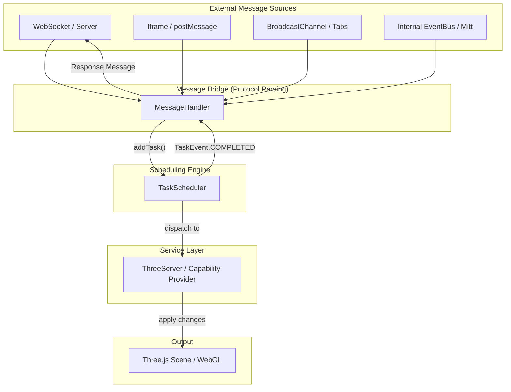

# Three.js Task Scheduler

A high-performance, industrial-grade TypeScript task scheduler designed specifically for Three.js 3D scenes and complex asynchronous workflows. It manages complex task dependencies efficiently through intelligent scheduling algorithms while maintaining a smooth UI at 60 FPS.

## 1. System Architecture

This project supports driving 3D scene updates through various communication channels (WebSocket, Iframe postMessage, BroadcastChannel, etc.). The architecture is as follows:


```mermaid
graph TD
    subgraph "External Message Sources"
        WS[WebSocket / Server]
        PM[Iframe / postMessage]
        BC[BroadcastChannel / Tabs]
        MITT[Internal EventBus / Mitt]
    end

    subgraph "Message Bridge (Protocol Parsing)"
        MH[MessageHandler]
    end

    subgraph "Scheduling Engine"
        TS[TaskScheduler]
    end

    subgraph "Service Layer"
        TSV[ThreeServer / Capability Provider]
    end

    subgraph "Output"
        SCENE[Three.js Scene / WebGL]
    end

    %% Data Flow
    WS --> MH
    PM --> MH
    BC --> MH
    MITT --> MH

    MH -- "addTask()" --> TS
    TS -- "dispatch to" --> TSV
    TSV -- "apply changes" --> SCENE

    %% Return Flow
    TS -- "TaskEvent.COMPLETED" --> MH
    MH -- "Response Message" --> WS
```

## 2. Core Features (v2.0 Optimized)

✅ **Intelligent Scheduling Algorithm**

- **DAG Dependency Management**: Event-driven triggering based on Directed Acyclic Graphs, eliminating busy-polling.
- **Priority Inheritance**: Automatically elevates dependency chain priority to resolve "priority inversion" deadlocks.
- **Environment-Aware Scheduling**: Adaptive to browser `RAF` and background/Node.js `setTimeout`.

✅ **Task Control and Fault Tolerance**

- **Exponential Backoff Retry**: Retry delays increase exponentially with each attempt, protecting system load.
- **Cooperative Scheduling Support**: Provides `context.shouldYield()`, allowing long tasks to be smoothly fragmented.
- **Automatic Resource Cleanup**: Built-in garbage collection mechanism that automatically cleans up historical task states based on `retentionPeriod`, preventing memory leaks.

## 3. Efficient Integration Guide: ThreeServer + TaskScheduler

If you have a `ThreeServer` class containing many drawing and model processing methods, it is recommended to use the **"Command Dispatch Pattern"** for integration.

### 3.1 Modifying Service Class Methods

Make `ThreeServer` methods aware of the scheduling context to achieve true asynchronous fragmented execution.

```typescript
class ThreeServer {
  // Example: Batch drawing complex points
  async drawComplexPoints(data: any, context: TaskContext) {
    const { points } = data
    for (let i = 0; i < points.length; i++) {
      // 1. Respond to abort signal
      if (context.signal.aborted) return

      // 2. Execute graphics operations
      this.addPointToScene(points[i])

      // 3. Efficient integration point: Check every 100 elements if the main thread needs to be yielded
      if (i % 100 === 0 && context.shouldYield()) {
        await new Promise((resolve) => setTimeout(resolve, 0))
      }

      context.reportProgress((i / points.length) * 100)
    }
  }
}
```

### 3.2 Injecting Scheduler Capabilities

At application initialization, register the `ThreeServer` instance methods as executors for the scheduler.

```typescript
const threeServer = new ThreeServer(scene)
const scheduler = new TaskScheduler()

// Establish mapping relationships
scheduler.registerExecutor(TaskType.DRAW_POINTS, (data, context) =>
  threeServer.drawComplexPoints(data, context),
)

scheduler.registerExecutor(TaskType.LOAD_MODEL, (data, context) =>
  threeServer.loadModel(data, context),
)

scheduler.start()
```

### 3.3 Combining Multi-Channel Communication

Utilize the protocol parsing layer to convert external messages into scheduled tasks.

```typescript
// Taking WebSocket as an example
socket.onmessage = (event) => {
  const msg = JSON.parse(event.data)

  // Convert to scheduler task
  scheduler.addTask({
    id: msg.id,
    type: msg.commandType, // e.g., TaskType.DRAW_POINTS
    data: msg.payload,
    priority: msg.priority || TaskPriority.NORMAL,
  })
}
```

## 4. Quick Start

### 4.1 Basic Configuration

```typescript
import { TaskScheduler } from './TaskScheduler'
import { TaskType, TaskPriority, TaskRetryStrategy } from './types'

const scheduler = new TaskScheduler({
  maxTasksPerFrame: 5, // Start up to 5 new tasks per frame
  frameTimeBudget: 6, // 6ms budget allocated for JS execution per frame (reserving space for rendering)
  maxConcurrentTasks: 3, // Maximum number of concurrent asynchronous tasks
  retentionPeriod: 60000, // Completed task state retained for 60 seconds before auto-cleanup
})

scheduler.start()
```

### 4.2 Defining Cooperative Tasks

```typescript
scheduler.registerExecutor(TaskType.COMPUTE, async (data, context) => {
  for (let i = 0; i < data.items.length; i++) {
    // 1. Check abort signal
    if (context.signal.aborted) throw new Error('Cancelled')

    // 2. Cooperative scheduling: If the current frame budget is exhausted, proactively yield
    if (context.shouldYield()) {
      await new Promise((resolve) => setTimeout(resolve, 0))
    }

    processItem(data.items[i])
    context.reportProgress((i / data.items.length) * 100)
  }
})
```

### 4.3 Using Advanced Retries and Dependencies

```typescript
const taskId = scheduler.addTask({
  type: TaskType.LOAD_MODEL,
  priority: TaskPriority.NORMAL,
  retryCount: 3,
  retryStrategy: TaskRetryStrategy.EXPONENTIAL, // Exponential backoff retry
  dependencies: ['pre-config-task'], // Only triggered after pre-config-task is completed
  data: { url: '/models/scene.glb' },
})
```

## API Reference

### SchedulerConfig (Configuration)

| Parameter            | Type     | Default Value | Description                                               |
| :------------------- | :------- | :------------ | :-------------------------------------------------------- |
| `maxTasksPerFrame`   | `number` | `5`           | Maximum tasks allowed to start from the queue per frame   |
| `frameTimeBudget`    | `number` | `6`           | Execution time budget per frame (ms)                      |
| `maxConcurrentTasks` | `number` | `3`           | Upper limit for tasks simultaneously in the RUNNING state |
| `retentionPeriod`    | `number` | `60000`       | Duration to retain status after task completion (ms)      |
| `queueSizeLimit`     | `number` | `1000`        | Maximum capacity of the task pool                         |

### TaskContext (Execution Context)

| Property/Method     | Description                                                                                                  |
| :------------------ | :----------------------------------------------------------------------------------------------------------- |
| `taskId`            | Unique ID of the current task                                                                                |
| `signal`            | `AbortSignal` object, used to respond to cancellation operations                                             |
| `reportProgress(n)` | Report progress (0-100)                                                                                      |
| `shouldYield()`     | **Core Method**: Returns true if the current frame budget is exhausted, suggesting the task `await` to yield |

## Advanced Mechanism Explanation

### Priority Inheritance Principle

When a `HIGH` priority task is added to the scheduler and it depends on a `LOW` priority task already in the queue:

1. The scheduler recursively traverses the dependency chain.
2. Temporarily elevates that `LOW` task to `HIGH` priority.
3. Ensures the dependency is executed as early as possible, avoiding unnecessary blocking of the high-priority task.

### Automated Resource Management

The scheduler internally maintains a timer that scans the `taskMap` every 10 seconds. Any task that has reached a terminal state (`COMPLETED`/`FAILED`/`CANCELLED`) and exceeded the `retentionPeriod` will be physically removed to maintain memory stability in long-lifecycle applications.

## Debugging and Monitoring

```typescript
const stats = scheduler.getStats()
console.log(`Current FPS: ${stats.fps}`)
console.log(`Pending tasks: ${stats.pendingTasks}`)
console.log(`Average wait time: ${stats.averageWaitTime}ms`)
```

## License

MIT
